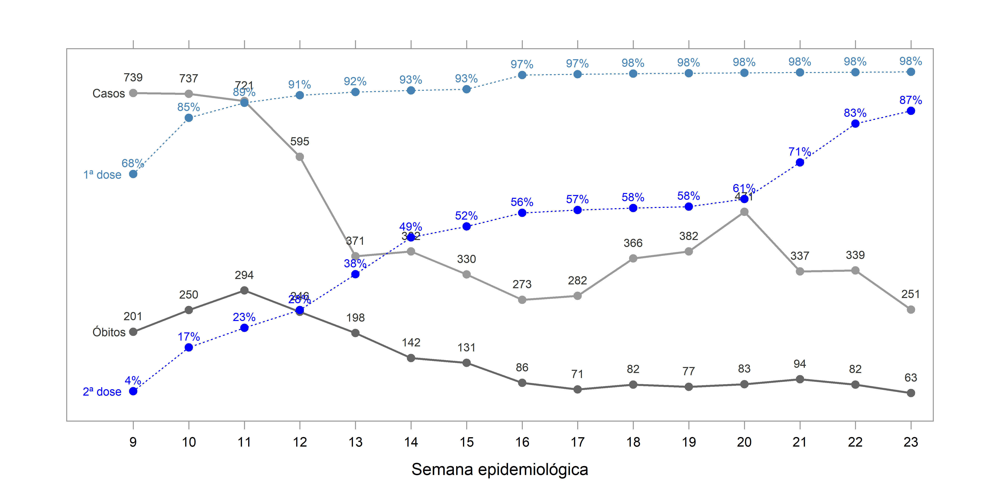
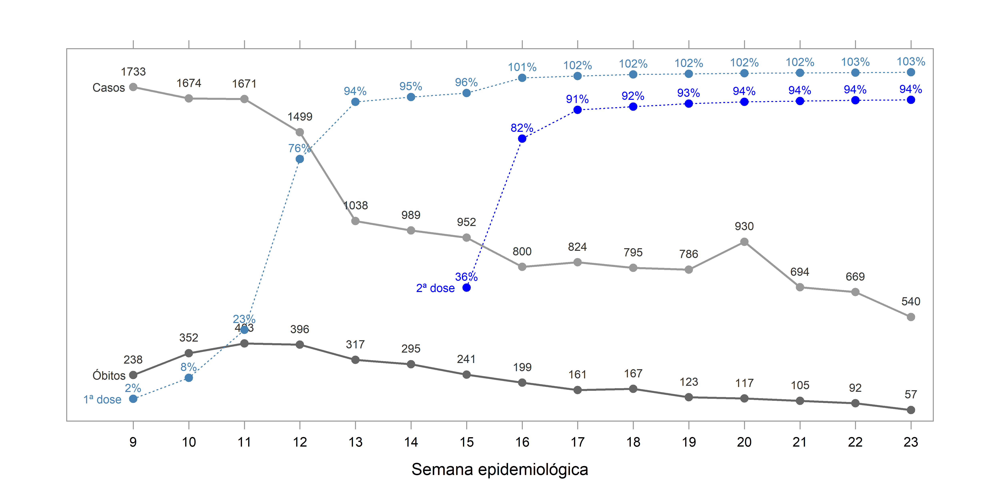
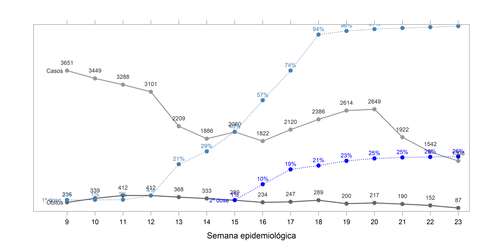
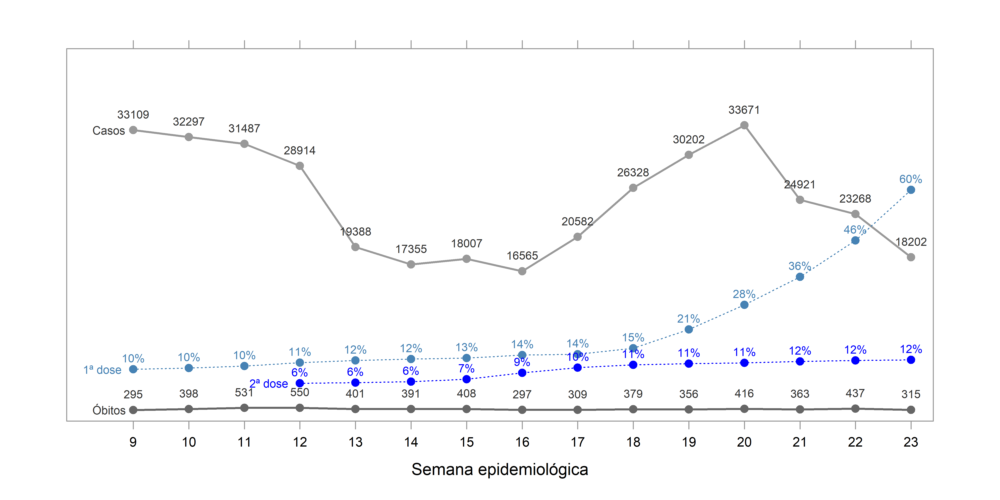
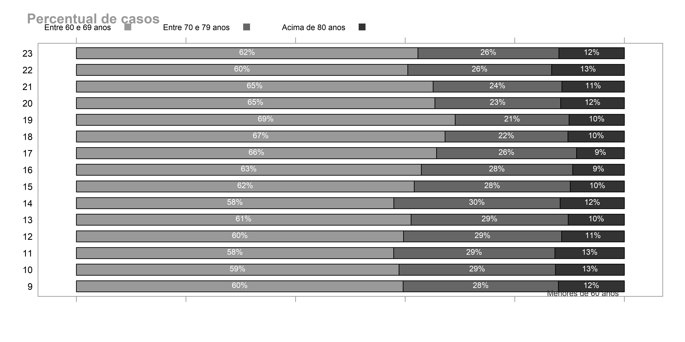
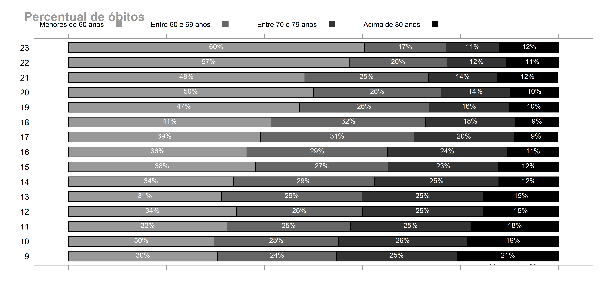

```{r, setup, include=FALSE}
knitr::opts_chunk$set(fig.width = 10, fig.height = 5, collapse = TRUE)
ponto <- function(x) format(x, big.mark = ".")
```

<style type="text/css">
  body{
  font-size: 11pt;
     font-family: arial;
}
</style>

<style type="text/css">

.chart-title {  /* chart_title  */
   font-size: 11pt;
   font-family: arial;
</style>

# Index
Neste site têm-se dados de vacinação da Covid-19 no estado do Paraná para faixas de **80 anos ou mais**, **70 a 79 anos**, **60 a 69 anos** e **abaixo de 60 anos**. As três primeiras faixas de idade fazem parte do grupo prioriátio 2, conforme definido pela Secretaria de saúde do estado do Paraná, correspondendo a um total de 1.781.543 pessoas (44% do grupo prioriário - 4.080.010 pessoas).

```{r, echo = FALSE, message=FALSE}
require(data.table)
require(lattice)
require(dplyr)
require(scales)
require(lubridate)
require(latticeExtra)
options(scipen = 999)

setwd("C:/Users/marcelo.maceno/Documents/projeto_corona")

#############################################################
#DADOS DE CASOS DE COVID                                    #
#############################################################
dados_covid <- fread("https://www.saude.pr.gov.br/sites/default/arquivos_restritos/files/documento/2021-05/informe_epidemiologico_30_05_2021_geral.csv",
                     encoding = 'UTF-8', select = c("IDADE_ORIGINAL","DATA_DIAGNOSTICO","DATA_OBITO"))

dados_covid2 <- dados_covid
dados_covid2$DATA_DIAGNOSTICO <- as.Date(dados_covid2$DATA_DIAGNOSTICO, format="%d/%m/%Y")
dados_covid2$Ano <- format(dados_covid2$DATA_DIAGNOSTICO,"%Y")
dados_covid3 <- subset(dados_covid2, Ano == 2021 & DATA_DIAGNOSTICO > "2021-01-02")
dados_covid3$semana <- epiweek(dados_covid3$DATA_DIAGNOSTICO)
dados_covid3$faixaidade <- cut(dados_covid3$IDADE_ORIGINAL, c(0,59,69,79,Inf))
levels(dados_covid3$faixaidade) <- c("Menores de 60 anos","Entre 60 e 69 anos","Entre 70 e 79 anos","Acima de 80 anos")
ultima_semana <- max(dados_covid3$semana)
dados_covid4 <- dados_covid3

#Número de casos de covid para faixas de idade separados por semana
dados_covid_casos <- dados_covid3 %>%
  group_by(faixaidade, semana) %>%
  summarize(incidencia = n()) %>%
  filter(semana != ultima_semana) %>%
  mutate(acum = cumsum(incidencia)) %>%
  mutate(grupo = "casos")

dados_covid_casos <- subset(dados_covid_casos, semana > max(dados_covid_casos$semana)-15)

#Número de óbitos por covid separado por semana
dados_covid2 <- dados_covid
dados_covid2$DATA_OBITO <- as.Date(dados_covid2$DATA_OBITO, format="%d/%m/%Y")
dados_covid2$Ano <- format(dados_covid2$DATA_OBITO,"%Y")
dados_covid3 <- subset(dados_covid2, Ano == 2021 & DATA_OBITO > "2021-01-02")
dados_covid3$semana <- epiweek(dados_covid3$DATA_OBITO)
dados_covid3$faixaidade <- cut(dados_covid3$IDADE_ORIGINAL, c(0,59,69,79,Inf))
levels(dados_covid3$faixaidade) <- c("Menores de 60 anos","Entre 60 e 69 anos","Entre 70 e 79 anos","Acima de 80 anos")
dados_covid5 <- dados_covid3

dados_covid_obitos <- dados_covid3 %>%
  group_by(faixaidade, semana) %>%
  summarize(incidencia = n()) %>%
  filter(semana != ultima_semana) %>%
  mutate(acum = cumsum(incidencia)) %>%
  mutate(grupo = "óbitos")

dados_covid_obitos <- subset(dados_covid_obitos, semana > max(dados_covid_obitos$semana)-15)

##############################################################
#DADOS DA VACINA                                             #
##############################################################
dados_vacina <- fread("https://s3-sa-east-1.amazonaws.com/ckan.saude.gov.br/PNI/vacina/uf/2021-05-30/uf%3DPR/part-00000-c6f35be5-568b-4cdc-8a34-55616fec6ab1.c000.csv",
                      encoding = 'UTF-8', select = c("paciente_idade","vacina_dataaplicacao","vacina_descricao_dose"))
dados_vacina$ind <- 1
dados_vacina$vacina_descricao_dose <- as.factor(dados_vacina$vacina_descricao_dose)
dados_vacina <- subset(dados_vacina, vacina_descricao_dose != levels(dados_vacina$vacina_descricao_dose)[3])
dados_vacina$semana <- epiweek(dados_vacina$vacina_dataaplicacao)
dados_vacina$faixaidade <- cut(dados_vacina$paciente_idade, c(0,59,69,79,Inf))
levels(dados_vacina$faixaidade) <- c("Menores de 60 anos","Entre 60 e 69 anos","Entre 70 e 79 anos","Acima de 80 anos")

#Primeira e segunda dose
prim_dose <- levels(dados_vacina$vacina_descricao_dose)[1]
seg_dose <- levels(dados_vacina$vacina_descricao_dose)[2]

#Total de pessoas por faixa etária
total80 <- 250630
total70 <- 537275
total60 <- 993908
totalmenos60 <- 4080010 - total80 - total70 - total60

grupos <- c(totalmenos60,total60,total70,total80)
indice <- c("Menores de 60 anos","Entre 60 e 69 anos","Entre 70 e 79 anos","Acima de 80 anos")
dados_vacina$grupos <- grupos[match(dados_vacina$faixaidade, indice)]

#Dados de vacinados para faixas de idade separados por semana
dados_vacina_agrup <- dados_vacina %>%
  group_by(faixaidade, grupos, vacina_descricao_dose, semana)  %>%
  summarize(incidencia = n()) %>%
  filter(semana != ultima_semana) %>%
  mutate(soma = cumsum(incidencia)) %>%
  mutate(perc = soma/grupos) %>%
  mutate(perc2 = label_percent(accuracy = 1)(perc))

dados_vacina_agrup <- subset(dados_vacina_agrup, semana > max(dados_vacina_agrup$semana)-15)

#############################################################
#Gráficos                                                   #
#############################################################
dados_covid_uniao <- rbind(dados_covid_casos,dados_covid_obitos)
dados_covid_uniao <- subset(dados_covid_uniao, semana > max(dados_covid_uniao$semana)-15)

#############################################################
#80 anos ou mais                                            #
#############################################################
dados_covid_casos2 <- subset(dados_covid_casos, faixaidade == "Acima de 80 anos")
dados_covid_obitos2 <- subset(dados_covid_obitos, faixaidade == "Acima de 80 anos")
dados_vacina_agrup2 <- subset(dados_vacina_agrup, faixaidade == "Acima de 80 anos")
dados_covid_uniao2 <- subset(dados_covid_uniao, faixaidade == "Acima de 80 anos")

num_vacin_prim_dose <- max(subset(dados_vacina_agrup2, vacina_descricao_dose == prim_dose)$soma)
num_vacin_seg_dose <- max(subset(dados_vacina_agrup2, vacina_descricao_dose == seg_dose)$soma)
```

# 80 anos ou mais

### Nesta faixa de idade têm-se `r ponto(total80)` pessoas. Até a semana epidemiológica `r max(dados_vacina_agrup2$semana)`, segundo dados obtidos do [Ministério da Saúde](https://opendatasus.saude.gov.br/dataset/covid-19-vacinacao), foram vacinadas `r ponto(num_vacin_prim_dose)` pessoas com a 1ª dose e `r ponto(num_vacin_seg_dose)` pessoas com a 2ª dose no estado do Paraná.

```{r, echo=FALSE, message=FALSE, warning=FALSE, fig.width=10, fig.height=5, dpi=500}
png(file="grafico_80anosoumais.png",
    width=10, height=5, units="in", res=500)
obj1 <- xyplot(incidencia ~ semana,
               group = grupo,
               type = "o",
               col = c(gray(0.6),gray(0.4)),
               lty = 1,
               pch = 19,
               cex = 0.9,
               lwd = 2,
               ylab = NULL,
               xlab = "Semana epidemiológica",
               xlim = c(max(dados_covid_uniao$semana)-15.2,max(dados_covid_uniao$semana)+0.4),
               ylim = c(0,max(dados_covid_uniao2$incidencia)+100),
               scales = list(x=list(at=(max(dados_covid_uniao$semana)-14):max(dados_covid_uniao$semana), label = dados_covid_casos2$semana),y=list(col=0)),
               data = dados_covid_uniao2,
               par.settings=list(axis.line=list(col=gray(0.6))),
               panel = function(x, y, ...) {
                 panel.xyplot(x, y, ...)
                 panel.text(x=dados_covid_casos2$semana,y=dados_covid_casos2$incidencia, labels = dados_covid_casos2$incidencia, 
                            col = grey(0.2), cex = 0.7, pos = 3, offset = 1)
                 panel.text(x=dados_covid_obitos2$semana,y=dados_covid_obitos2$incidencia, labels = dados_covid_obitos2$incidencia, 
                            col = grey(0.2), cex = 0.7, pos = 3, offset = 1)
                 panel.text(x=dados_covid_casos2$semana[1],y=dados_covid_casos2$incidencia[1], labels = "Casos", 
                            col = grey(0.2), cex = 0.7, pos = 4, offset = -3.5)
                 panel.text(x=dados_covid_obitos2$semana[1],y=dados_covid_obitos2$incidencia[1], labels = "Óbitos", 
                            col = grey(0.2), cex = 0.7, pos = 4, offset = -3.5)
                 
               })


obj2 <- xyplot(perc ~ semana,
               group = vacina_descricao_dose,
               type = "o",
               col = c("steel blue","blue"),
               lty = 3,
               pch = 19,
               cex = 0.9,
               ylab = NULL,
               xlim = c(max(dados_covid_uniao$semana)-15.2,max(dados_covid_uniao$semana)+0.4),
               ylim = c(-0.05,1.05),
               scales = list(x=list(at=(max(subset(dados_vacina_agrup2, vacina_descricao_dose == prim_dose)$semana)-14):max(subset(dados_vacina_agrup2, vacina_descricao_dose == prim_dose)$semana), label = subset(dados_vacina_agrup2, vacina_descricao_dose == prim_dose)$semana),y=list(col=0)),
               data = dados_vacina_agrup2,
               par.settings=list(axis.line=list(col=gray(0.6))),
               panel = function(x, y, ...) {
                 panel.xyplot(x, y, ...)
                 panel.text(x=subset(dados_vacina_agrup2, vacina_descricao_dose == prim_dose)$semana,y=subset(dados_vacina_agrup2, vacina_descricao_dose == prim_dose)$perc, labels = subset(dados_vacina_agrup2, vacina_descricao_dose == prim_dose)$perc2, 
                            col = "steel blue", cex = 0.7, pos = 3, offset = 0.6)
                 panel.text(x=subset(dados_vacina_agrup2, vacina_descricao_dose == seg_dose)$semana,y=subset(dados_vacina_agrup2, vacina_descricao_dose == seg_dose)$perc, labels = subset(dados_vacina_agrup2, vacina_descricao_dose == seg_dose)$perc2, 
                            col = "blue", cex = 0.7, pos = 3, offset = 0.6)
                 panel.text(x=subset(dados_vacina_agrup2, vacina_descricao_dose == prim_dose)$semana[1],y=subset(dados_vacina_agrup2, vacina_descricao_dose == prim_dose)$perc[1], labels = "1ª dose", 
                            col = "steel blue", cex = 0.7, pos = 2, offset = 1)
                 panel.text(x=subset(dados_vacina_agrup2, vacina_descricao_dose == seg_dose)$semana[1],y=subset(dados_vacina_agrup2, vacina_descricao_dose == seg_dose)$perc[1], labels = "2ª dose", 
                            col = "blue", cex = 0.7, pos = 2, offset = 1)
               })

doubleYScale(obj1,obj2)

update(trellis.last.object(),
       par.settings = simpleTheme(col = c(gray(1), gray(1))))
invisible(dev.off())
```

{width=100%}

```{r, echo=FALSE, message=FALSE}
#############################################################
#70 anos ou mais                                            #
#############################################################
dados_covid_casos3 <- subset(dados_covid_casos, faixaidade == "Entre 70 e 79 anos")
dados_covid_obitos3 <- subset(dados_covid_obitos, faixaidade == "Entre 70 e 79 anos")
dados_vacina_agrup3 <- subset(dados_vacina_agrup, faixaidade == "Entre 70 e 79 anos")
dados_covid_uniao3 <- subset(dados_covid_uniao, faixaidade == "Entre 70 e 79 anos")

dados_vacina_agrup3 <- rbind(subset(dados_vacina_agrup3, vacina_descricao_dose == prim_dose),
                             subset(dados_vacina_agrup3, vacina_descricao_dose == seg_dose)[7:nrow(subset(dados_vacina_agrup3, vacina_descricao_dose == seg_dose)),])
                             

num_vacin_prim_dose <- max(subset(dados_vacina_agrup3, vacina_descricao_dose == prim_dose)$soma)
num_vacin_seg_dose <- max(subset(dados_vacina_agrup3, vacina_descricao_dose == seg_dose)$soma)
```

# 70 a 79 anos
### Nesta faixa de idade têm-se `r ponto(total70)` pessoas. Até a semana epidemiológica `r max(dados_vacina_agrup2$semana)`, segundo dados obtidos do [Ministério da Saúde](https://opendatasus.saude.gov.br/dataset/covid-19-vacinacao), foram vacinadas `r ponto(num_vacin_prim_dose)` pessoas com a 1ª dose e `r ponto(num_vacin_seg_dose)` pessoas com a 2ª dose no estado do Paraná.

```{r, echo=FALSE, message=FALSE, warning=FALSE}
png(file="grafico_70anos.png",
    width=10, height=5, units="in", res=500)
obj1 <- xyplot(incidencia ~ semana,
       group = grupo,
       type = "o",
       col = c(gray(0.6),gray(0.4)),
       lty = 1,
       pch = 19,
       cex = 0.9,
       lwd = 2,
       ylab = NULL,
       xlab = "Semana epidemiológica",
       xlim = c(max(dados_covid_uniao$semana)-15.2,max(dados_covid_uniao$semana)+0.4),
       ylim = c(0,max(dados_covid_uniao3$incidencia)+200),
       scales = list(x=list(at=(max(dados_covid_uniao$semana)-14):max(dados_covid_uniao$semana), label = dados_covid_casos2$semana),y=list(col=0)),
       data = dados_covid_uniao3,
       par.settings=list(axis.line=list(col=gray(0.6))),
       panel = function(x, y, ...) {
         panel.xyplot(x, y, ...)
         panel.text(x=dados_covid_casos3$semana,y=dados_covid_casos3$incidencia, labels = dados_covid_casos3$incidencia, 
                    col = grey(0.2), cex = 0.7, pos = 3, offset = 1)
         panel.text(x=dados_covid_obitos3$semana,y=dados_covid_obitos3$incidencia, labels = dados_covid_obitos3$incidencia, 
                    col = grey(0.2), cex = 0.7, pos = 3, offset = 1)
         panel.text(x=dados_covid_casos3$semana[1],y=dados_covid_casos3$incidencia[1], labels = "Casos", 
                    col = grey(0.2), cex = 0.7, pos = 4, offset = -3.5)
         panel.text(x=dados_covid_obitos3$semana[1],y=dados_covid_obitos3$incidencia[1], labels = "Óbitos", 
                    col = grey(0.2), cex = 0.7, pos = 4, offset = -3.5)

       })

  
obj2 <- xyplot(perc ~ semana,
               group = vacina_descricao_dose,
               type = "o",
               col = c("steel blue","blue"),
               lty = 3,
               pch = 19,
               cex = 0.9,
               ylab = NULL,
               xlim = c(max(dados_covid_uniao$semana)-15.2,max(dados_covid_uniao$semana)+0.4),
               ylim = c(-0.05,1.1),
               scales = list(x=list(at=(max(subset(dados_vacina_agrup2, vacina_descricao_dose == prim_dose)$semana)-14):max(subset(dados_vacina_agrup2, vacina_descricao_dose == prim_dose)$semana), label = subset(dados_vacina_agrup2, vacina_descricao_dose == prim_dose)$semana),y=list(col=0)),
               data = dados_vacina_agrup3,
               par.settings=list(axis.line=list(col=gray(0.6))),
               panel = function(x, y, ...) {
                 panel.xyplot(x, y, ...)
                 panel.text(x=subset(dados_vacina_agrup3, vacina_descricao_dose == prim_dose)$semana,y=subset(dados_vacina_agrup3, vacina_descricao_dose == prim_dose)$perc, labels = subset(dados_vacina_agrup3, vacina_descricao_dose == prim_dose)$perc2, 
                            col = "steel blue", cex = 0.7, pos = 3, offset = 0.6)
                 panel.text(x=subset(dados_vacina_agrup3, vacina_descricao_dose == seg_dose)$semana,y=subset(dados_vacina_agrup3, vacina_descricao_dose == seg_dose)$perc, labels = subset(dados_vacina_agrup3, vacina_descricao_dose == seg_dose)$perc2, 
                            col = "blue", cex = 0.7, pos = 3, offset = 0.6)
                 panel.text(x=subset(dados_vacina_agrup3, vacina_descricao_dose == prim_dose)$semana[1],y=subset(dados_vacina_agrup3, vacina_descricao_dose == prim_dose)$perc[1], labels = "1ª dose", 
                            col = "steel blue", cex = 0.7, pos = 2, offset = 1)
                 panel.text(x=subset(dados_vacina_agrup3, vacina_descricao_dose == seg_dose)$semana[1],y=subset(dados_vacina_agrup3, vacina_descricao_dose == seg_dose)$perc[1], labels = "2ª dose", 
                            col = "blue", cex = 0.7, pos = 2, offset = 1)
                 })

doubleYScale(obj1,obj2)
             
update(trellis.last.object(),
par.settings = simpleTheme(col = c(gray(1), gray(1))))
invisible(dev.off())
```



```{r, echo=FALSE, message=FALSE}
#############################################################
#60 a 69 anos                                               #
#############################################################
dados_covid_casos4 <- subset(dados_covid_casos, faixaidade == "Entre 60 e 69 anos")
dados_covid_obitos4 <- subset(dados_covid_obitos, faixaidade == "Entre 60 e 69 anos")
dados_vacina_agrup4 <- subset(dados_vacina_agrup, faixaidade == "Entre 60 e 69 anos")
dados_covid_uniao4 <- subset(dados_covid_uniao, faixaidade == "Entre 60 e 69 anos")

dados_vacina_agrup4 <- rbind(subset(dados_vacina_agrup4, vacina_descricao_dose == prim_dose),
                             subset(dados_vacina_agrup4, vacina_descricao_dose == seg_dose)[7:nrow(subset(dados_vacina_agrup4, vacina_descricao_dose == seg_dose)),])
                             

num_vacin_prim_dose <- max(subset(dados_vacina_agrup4, vacina_descricao_dose == prim_dose)$soma)
num_vacin_seg_dose <- max(subset(dados_vacina_agrup4, vacina_descricao_dose == seg_dose)$soma)
```

# 60 a 69 anos
### Nesta faixa de idade têm-se `r ponto(total60)` pessoas. Até a semana epidemiológica`r max(dados_vacina_agrup4$semana)`, segundo dados obtidos do [Ministério da Saúde](https://opendatasus.saude.gov.br/dataset/covid-19-vacinacao), foram vacinadas `r ponto(num_vacin_prim_dose)` pessoas com a 1ª dose e `r ponto(num_vacin_seg_dose)` pessoas com a 2ª dose no estado do Paraná.

```{r, echo=FALSE, message=FALSE, warning=FALSE}
png(file="grafico_60anos.png",
    width=10, height=5, units="in", res=500)
obj1 <- xyplot(incidencia ~ semana,
       group = grupo,
       type = "o",
       col = c(gray(0.6),gray(0.4)),
       lty = 1,
       pch = 19,
       cex = 0.9,
       lwd = 2,
       ylab = NULL,
       xlab = "Semana epidemiológica",
       xlim = c(max(dados_covid_uniao$semana)-15.2,max(dados_covid_uniao$semana)+0.4),
       ylim = c(0,max(dados_covid_uniao4$incidencia)+700),
       scales = list(x=list(at=(max(dados_covid_uniao$semana)-14):max(dados_covid_uniao$semana), label = dados_covid_casos2$semana),y=list(col=0)),
       data = dados_covid_uniao4,
       par.settings=list(axis.line=list(col=gray(0.6))),
       panel = function(x, y, ...) {
         panel.xyplot(x, y, ...)
         panel.text(x=dados_covid_casos4$semana,y=dados_covid_casos4$incidencia, labels = dados_covid_casos4$incidencia, 
                    col = grey(0.2), cex = 0.7, pos = 3, offset = 1)
         panel.text(x=dados_covid_obitos4$semana,y=dados_covid_obitos4$incidencia, labels = dados_covid_obitos4$incidencia, 
                    col = grey(0.2), cex = 0.7, pos = 3, offset = 1)
         panel.text(x=dados_covid_casos4$semana[1],y=dados_covid_casos4$incidencia[1], labels = "Casos", 
                    col = grey(0.2), cex = 0.7, pos = 4, offset = -3.5)
         panel.text(x=dados_covid_obitos4$semana[1],y=dados_covid_obitos4$incidencia[1], labels = "Óbitos", 
                    col = grey(0.2), cex = 0.7, pos = 4, offset = -3.5)

       })

  
obj2 <- xyplot(perc ~ semana,
               group = vacina_descricao_dose,
               type = "o",
               col = c("steel blue","blue"),
               lty = 3,
               pch = 19,
               cex = 0.9,
               ylab = NULL,
               xlim = c(max(dados_covid_uniao$semana)-15.2,max(dados_covid_uniao$semana)+0.4),
               ylim = c(-0.05,1),
               scales = list(x=list(at=(max(subset(dados_vacina_agrup2, vacina_descricao_dose == prim_dose)$semana)-14):max(subset(dados_vacina_agrup2, vacina_descricao_dose == prim_dose)$semana), label = subset(dados_vacina_agrup2, vacina_descricao_dose == prim_dose)$semana),y=list(col=0)),
               data = dados_vacina_agrup4,
               par.settings=list(axis.line=list(col=gray(0.6))),
               panel = function(x, y, ...) {
                 panel.xyplot(x, y, ...)
                 panel.text(x=subset(dados_vacina_agrup4, vacina_descricao_dose == prim_dose)$semana,y=subset(dados_vacina_agrup4, vacina_descricao_dose == prim_dose)$perc, labels = subset(dados_vacina_agrup4, vacina_descricao_dose == prim_dose)$perc2, 
                            col = "steel blue", cex = 0.7, pos = 3, offset = 0.6)
                 panel.text(x=subset(dados_vacina_agrup4, vacina_descricao_dose == seg_dose)$semana,y=subset(dados_vacina_agrup4, vacina_descricao_dose == seg_dose)$perc, labels = subset(dados_vacina_agrup4, vacina_descricao_dose == seg_dose)$perc2, 
                            col = "blue", cex = 0.7, pos = 3, offset = 0.6)
                 panel.text(x=subset(dados_vacina_agrup4, vacina_descricao_dose == prim_dose)$semana[1],y=subset(dados_vacina_agrup4, vacina_descricao_dose == prim_dose)$perc[1], labels = "1ª dose", 
                            col = "steel blue", cex = 0.7, pos = 2, offset = 1)
                 panel.text(x=subset(dados_vacina_agrup4, vacina_descricao_dose == seg_dose)$semana[1],y=subset(dados_vacina_agrup4, vacina_descricao_dose == seg_dose)$perc[1], labels = "2ª dose", 
                            col = "blue", cex = 0.7, pos = 2, offset = 1)
                 })

doubleYScale(obj1,obj2)
             
update(trellis.last.object(),
par.settings = simpleTheme(col = c(gray(1), gray(1))))
invisible(dev.off())
```



```{r, echo=FALSE, message=FALSE}
#############################################################
#Menores de 60 anos                                         #
#############################################################
dados_covid_casos5 <- subset(dados_covid_casos, faixaidade == "Menores de 60 anos")
dados_covid_obitos5 <- subset(dados_covid_obitos, faixaidade == "Menores de 60 anos")
dados_vacina_agrup5 <- subset(dados_vacina_agrup, faixaidade == "Menores de 60 anos")
dados_covid_uniao5 <- subset(dados_covid_uniao, faixaidade == "Menores de 60 anos")

dados_vacina_agrup5 <- rbind(subset(dados_vacina_agrup5, vacina_descricao_dose == prim_dose),
                             subset(dados_vacina_agrup5, vacina_descricao_dose == seg_dose)[4:nrow(subset(dados_vacina_agrup5, vacina_descricao_dose == seg_dose)),])
                             
num_vacin_prim_dose <- max(subset(dados_vacina_agrup5, vacina_descricao_dose == prim_dose)$soma)
num_vacin_seg_dose <- max(subset(dados_vacina_agrup5, vacina_descricao_dose == seg_dose)$soma)
```

# Abaixo de 60 anos
### Nesta faixa de idade têm-se `r ponto(totalmenos60)` pessoas (considerados apenas do grupo de risco). Até a semana epidemiológica `r max(dados_vacina_agrup5$semana)`, segundo dados obtidos do [Ministério da Saúde](https://opendatasus.saude.gov.br/dataset/covid-19-vacinacao), foram vacinadas `r ponto(num_vacin_prim_dose)` pessoas com a 1ª dose e `r ponto(num_vacin_seg_dose)` pessoas com a 2ª dose no estado do Paraná.

```{r, echo=FALSE, message=FALSE, warning=FALSE}
png(file="grafico_menores60anos.png",
    width=10, height=5, units="in", res=500)
obj1 <- xyplot(incidencia ~ semana,
       group = grupo,
       type = "o",
       col = c(gray(0.6),gray(0.4)),
       lty = 1,
       pch = 19,
       cex = 0.9,
       lwd = 2,
       ylab = NULL,
       xlab = "Semana epidemiológica",
       xlim = c(max(dados_covid_uniao$semana)-15.2,max(dados_covid_uniao$semana)+0.4),
       ylim = c(-1000,max(dados_covid_uniao5$incidencia)+9000),
       scales = list(x=list(at=(max(dados_covid_uniao$semana)-14):max(dados_covid_uniao$semana), label = dados_covid_casos2$semana),y=list(col=0)),
       data = dados_covid_uniao5,
       par.settings=list(axis.line=list(col=gray(0.6))),
       panel = function(x, y, ...) {
         panel.xyplot(x, y, ...)
         panel.text(x=dados_covid_casos5$semana,y=dados_covid_casos5$incidencia, labels = dados_covid_casos5$incidencia, 
                    col = grey(0.2), cex = 0.7, pos = 3, offset = 1)
         panel.text(x=dados_covid_obitos5$semana,y=dados_covid_obitos5$incidencia, labels = dados_covid_obitos5$incidencia, 
                    col = grey(0.2), cex = 0.7, pos = 3, offset = 1)
         panel.text(x=dados_covid_casos5$semana[1],y=dados_covid_casos5$incidencia[1], labels = "Casos", 
                    col = grey(0.2), cex = 0.7, pos = 4, offset = -3.5)
         panel.text(x=dados_covid_obitos5$semana[1],y=dados_covid_obitos5$incidencia[1], labels = "Óbitos", 
                    col = grey(0.2), cex = 0.7, pos = 4, offset = -3.5)

       })

  
obj2 <- xyplot(perc ~ semana,
               group = vacina_descricao_dose,
               type = "o",
               col = c("steel blue","blue"),
               lty = 3,
               pch = 19,
               cex = 0.9,
               ylab = NULL,
               xlim = c(max(dados_covid_uniao$semana)-15.2,max(dados_covid_uniao$semana)+0.4),
               ylim = c(-0.05,1),
               scales = list(x=list(at=(max(subset(dados_vacina_agrup2, vacina_descricao_dose == prim_dose)$semana)-14):max(subset(dados_vacina_agrup2, vacina_descricao_dose == prim_dose)$semana), label = subset(dados_vacina_agrup2, vacina_descricao_dose == prim_dose)$semana),y=list(col=0)),
               data = dados_vacina_agrup5,
               par.settings=list(axis.line=list(col=gray(0.6))),
               panel = function(x, y, ...) {
                 panel.xyplot(x, y, ...)
                 panel.text(x=subset(dados_vacina_agrup5, vacina_descricao_dose == prim_dose)$semana,y=subset(dados_vacina_agrup5, vacina_descricao_dose == prim_dose)$perc, labels = subset(dados_vacina_agrup5, vacina_descricao_dose == prim_dose)$perc2, 
                            col = "steel blue", cex = 0.7, pos = 3, offset = 0.6)
                 panel.text(x=subset(dados_vacina_agrup5, vacina_descricao_dose == seg_dose)$semana,y=subset(dados_vacina_agrup5, vacina_descricao_dose == seg_dose)$perc, labels = subset(dados_vacina_agrup5, vacina_descricao_dose == seg_dose)$perc2, 
                            col = "blue", cex = 0.7, pos = 3, offset = 0.6)
                 panel.text(x=subset(dados_vacina_agrup5, vacina_descricao_dose == prim_dose)$semana[1],y=subset(dados_vacina_agrup5, vacina_descricao_dose == prim_dose)$perc[1], labels = "1ª dose", 
                            col = "steel blue", cex = 0.7, pos = 2, offset = 1)
                 panel.text(x=subset(dados_vacina_agrup5, vacina_descricao_dose == seg_dose)$semana[1],y=subset(dados_vacina_agrup5, vacina_descricao_dose == seg_dose)$perc[1], labels = "2ª dose", 
                            col = "blue", cex = 0.7, pos = 2, offset = 1)
                 })

doubleYScale(obj1,obj2)
             
update(trellis.last.object(),
par.settings = simpleTheme(col = c(gray(1), gray(1))))
invisible(dev.off())
```



# Outros

Column {data-width=200}
-------------------------------------

### Variação de óbitos em relação à semana anterior

```{r, echo=FALSE}
dados_obitos_perc2 <- label_percent(accuracy = 1)((dados_covid_obitos2$incidencia[15]-dados_covid_obitos2$incidencia[14])/dados_covid_obitos2$incidencia[14])
dados_obitos_perc3 <- label_percent(accuracy = 1)((dados_covid_obitos3$incidencia[15]-dados_covid_obitos3$incidencia[14])/dados_covid_obitos3$incidencia[14])
dados_obitos_perc4 <- label_percent(accuracy = 1)((dados_covid_obitos4$incidencia[15]-dados_covid_obitos4$incidencia[14])/dados_covid_obitos4$incidencia[14])
dados_obitos_perc5 <- label_percent(accuracy = 1)((dados_covid_obitos5$incidencia[15]-dados_covid_obitos5$incidencia[14])/dados_covid_obitos5$incidencia[14])

dados_obitos_var <- data.frame(faixasdeidade = c("Acima de 80 anos","Entre 70 e 79 anos","Entre 60 e 69 anos","Menores de 60 anos"),
                               variação = c(dados_obitos_perc2,dados_obitos_perc3,dados_obitos_perc4,dados_obitos_perc5))

knitr::kable(
  dados_obitos_var,
  col.names = c("Faixas de idade","Variação (%)"),
  align = "c"
)
```

Column {data-width=800} {.tabset}
-------------------------------------
   
```{r, echo=FALSE, message=FALSE}
dados_covid_casos6 <- dados_covid4 %>%
  group_by(semana, faixaidade) %>%
  summarize(incidencia = n()) %>%
  filter(semana != ultima_semana) %>%
  filter(faixaidade != "Menores de 60 anos") %>%
  mutate(total = sum(incidencia)) %>%
  mutate(perc = incidencia/total) %>%
  mutate(perc2 = label_percent(accuracy = 1)(perc)) %>%
  mutate(perc_acum1 = cumsum(perc)) %>%
  mutate(perc_acum2 = cumsum(perc)-perc) %>%
  mutate(perc_acum = (perc_acum1+perc_acum2)/2) %>%
  filter(faixaidade != "NA") %>%
  mutate(grupo = "casos")
dados_covid_casos6$semana <- as.factor(dados_covid_casos6$semana)
dados_covid_casos6 <- droplevels(dados_covid_casos6)

dados_covid_obitos6 <- dados_covid5 %>%
  group_by(semana, faixaidade) %>%
  summarize(incidencia = n()) %>%
  filter(semana != ultima_semana) %>%
  mutate(total = sum(incidencia)) %>%
  mutate(perc = incidencia/total) %>%
  mutate(perc2 = label_percent(accuracy = 1)(perc)) %>%
  mutate(perc_acum1 = cumsum(perc)) %>%
  mutate(perc_acum2 = cumsum(perc)-perc) %>%
  mutate(perc_acum = (perc_acum1+perc_acum2)/2) %>%
  filter(faixaidade != "NA") %>%
  mutate(grupo = "óbitos")
dados_covid_obitos6$semana <- as.factor(dados_covid_obitos6$semana)
dados_covid_obitos6 <- droplevels(dados_covid_obitos6)

cores1 <- c(gray(0.6),gray(0.4),gray(0.2),gray(0))
```

```{r, echo=FALSE, message=FALSE, warning=FALSE}
png(file="grafico_casos_faixasidade.png",
    width=10, height=5, units="in", res=500)
barchart(semana ~ perc,
       group = faixaidade,
       col = cores1,
       cex = 0.9,
       main = list("Percentual de casos", col=gray(0.6)),
       stack = TRUE,
       horizontal = TRUE,
       xlab = NULL,
       scales = list(x=list(col=0)),
       data = dados_covid_casos6,
       auto.key = list(columns = 3, cex=0.7, y = grid::unit(4, "in")),
       par.settings=list(superpose.symbol=list(pch=15, cex=1.2, col=cores1, fill=cores1),
                         axis.line=list(col=gray(0.6)),
                         par.main.text = list(just = "left", 
                                              x = grid::unit(10, "mm"),
                                              y = grid::unit(-1, "mm"))),
       panel = function(x, y, ...) {
         panel.barchart(x, y, ...)
         panel.text(x=dados_covid_casos6$perc_acum,y=dados_covid_casos6$semana, labels = dados_covid_casos6$perc2, 
                    col = grey(1), cex = 0.7, pos = 3, offset = -0.2)
         panel.text(x=dados_covid_casos6$semana[1],y=dados_covid_casos6$perc[1], labels = "Menores de 60 anos", 
                    col = grey(0.2), cex = 0.7, pos = 2, offset = 0.7)
       })
invisible(dev.off())


png(file="grafico_obitos_faixasidade.png",
    width=10, height=5, units="in", res=500)
barchart(semana ~ perc,
         group = faixaidade,
         col = cores1,
         cex = 0.9,
         main = list("Percentual de óbitos", col=gray(0.6)),
         stack = TRUE,
         horizontal = TRUE,
         xlab = NULL,
         scales = list(x=list(col=0)),
         data = dados_covid_obitos6,
         auto.key = list(columns = 4, cex=0.7, y = grid::unit(4, "in")),
         par.settings=list(superpose.symbol=list(pch=15, cex=1.2, col=cores1, fill=cores1),
                           axis.line=list(col=gray(0.6)),
                           par.main.text = list(just = "left", 
                                                x = grid::unit(10, "mm"),
                                                y = grid::unit(-1, "mm"))),
         panel = function(x, y, ...) {
           panel.barchart(x, y, ...)
           panel.text(x=dados_covid_obitos6$perc_acum,y=dados_covid_obitos6$semana, labels = dados_covid_obitos6$perc2, 
                      col = grey(1), cex = 0.7, pos = 3, offset = -0.2)
           panel.text(x=dados_covid_obitos6$semana[1],y=dados_covid_obitos6$perc[1], labels = "Menores de 60 anos", 
                      col = grey(0.2), cex = 0.7, pos = 2, offset = 0.7)
         })
invisible(dev.off())
```

### Percentual de casos por semana epidemiológica

{width=100%}
    
### Percentual de óbitos por semana epidemiológica

{width=100%}